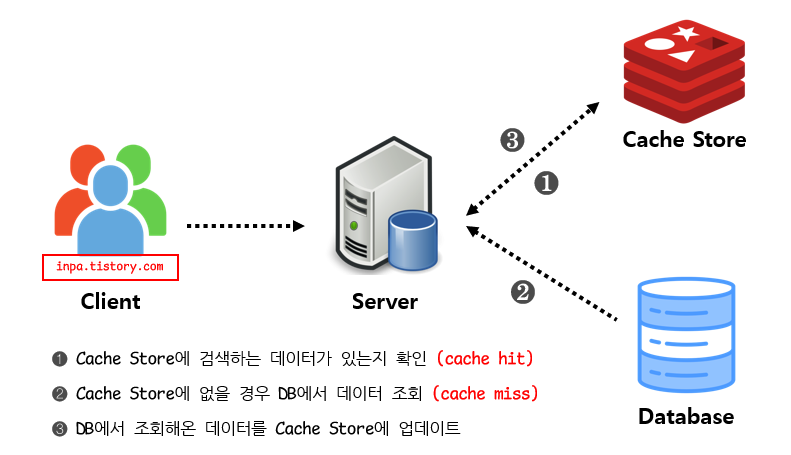
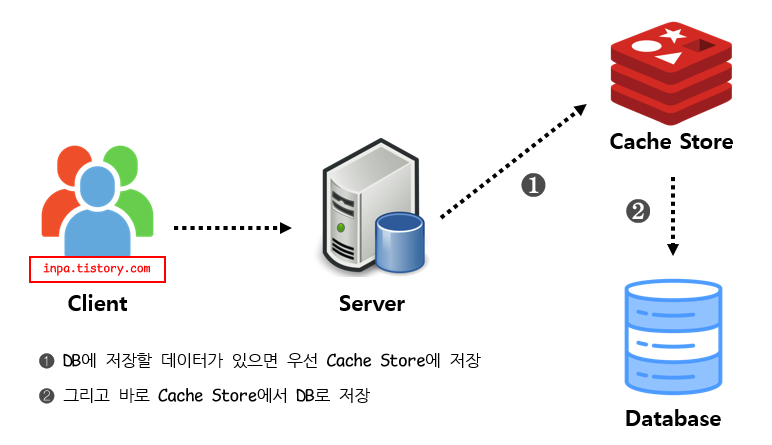

# 🚀 캐시 적용 보고서: Redis를 활용한 성능 최적화 전략

## 1. 개요

본 문서는 동시성 이슈가 자주 발생하는 도메인(잔액, 재고 등)에 대해 Redis 캐시를 활용한 성능 최적화 배경과 전략을 설명합니다.

- **주요 대상**
  - 사용자 잔액 정보 (`account`)
  - 상품 재고 정보 (`product`)
- **공통 조건**: 조회 빈도 높고, 데이터 변경도 빈번한 도메인

---

## 2. 캐시 적용 이유

동시성 이슈가 자주 발생하는 도메인의 경우, 여러 사용자 또는 여러 요청이 동시에 발생하며 잦은 데이터 변경이 수반됩니다.

이러한 상황에서 데이터 조회 시 매번 데이터베이스에 접근하고 락(Lock)을 획득한다면 다음과 같은 문제가 발생합니다:

- 📉 **성능 저하**: 매 요청마다 DB 접근 및 락 획득으로 처리 지연
- 🔒 **락 경합**: 트랜잭션 간 충돌로 병목 발생 가능성
- 💥 **확장성 저하**: 사용자 증가 시 시스템 병목이 가속화

따라서 **자주 조회되며 변경도 잦은 데이터**에 대해 캐시를 적용하여 **빠른 응답성과 부하 분산**을 도모하는 것이 효과적이라고 판단하였습니다.

---

## 3. 캐시 전략

캐시 전략으로는 **Look Aside 패턴 + Write Through 패턴**을 조합하여 구현하였습니다.

### ✅ Look Aside 패턴

- 데이터 조회 시 캐시에서 먼저 확인
- 캐시에 없으면 DB에서 조회 후, 캐시에 저장

**장점**:
- 캐시 미스 시 DB fallback 가능
- 캐시 장애 시에도 시스템 지속 가능

### ✅ Write Through 패턴

- 데이터 변경 시 캐시와 DB에 동시에 반영

**장점**:
- 데이터 정합성 확보 (캐시와 DB 동기화)

---

## 4. 캐시 전략

다음은 적용한 캐시 전략 패턴의 전체 흐름을 나타낸 그림입니다:
### 읽기 전략 - Look Aside

### 쓰기 전략 - Write Through

출처: [INPA 블로그 - Redis 캐시 설계 전략](https://inpa.tistory.com/entry/REDIS-%F0%9F%93%9A-%EC%BA%90%EC%8B%9CCache-%EC%84%A4%EA%B3%84-%EC%A0%84%EB%9E%B5-%EC%A7%80%EC%B9%A8-%EC%B4%9D%EC%A0%95%EB%A6%AC)

---

## 5. 캐시 적용 기대 효과

| 항목 | 기대 효과 |
|------|------------|
| 🚀 응답 속도 | 캐시 히트 시 수 ms 내 응답 가능 |
| 🔁 부하 분산 | DB에 대한 조회 요청 최소화 |
| 🔒 정합성 유지 | Write Through 방식으로 DB와 캐시의 동기화 |
| 🧠 안정성 | 캐시 장애 시에도 fallback 처리 가능 |

---

## 6. 향후 개선 방향

- ⏱ TTL 설정 및 LRU 정책으로 캐시 메모리 최적화
- ✅ 캐시 키 통일 전략 수립 및 공통 키 관리 클래스 도입

---

## 7. 결론

캐시는 단순한 조회 속도 개선을 넘어 **서비스 전반의 안정성과 확장성 확보**에 핵심적인 역할을 합니다.

특히 동시성 이슈가 빈번하고 변경이 잦은 도메인에서는 캐시를 통해 **락 경합을 줄이고**, **시스템 부하를 줄이며**, **사용자 경험을 개선**할 수 있습니다.

향후에도 도메인 특성에 따라 캐시 전략을 선별적으로 적용하고, 정합성과 성능 간 균형을 유지하는 설계를 지속할 예정입니다.