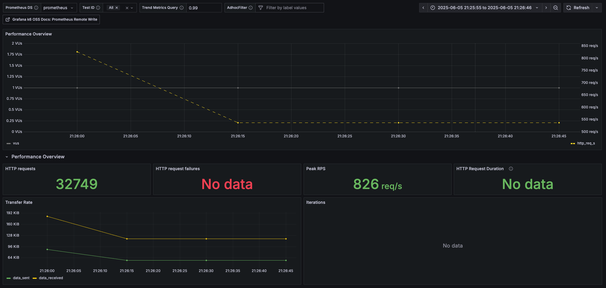
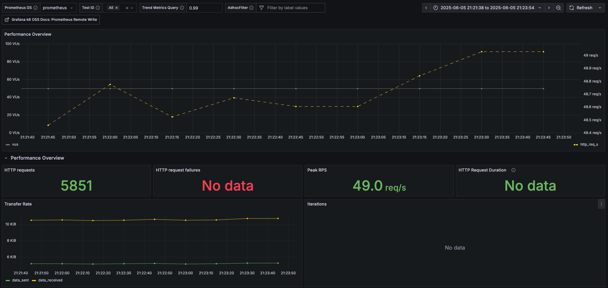
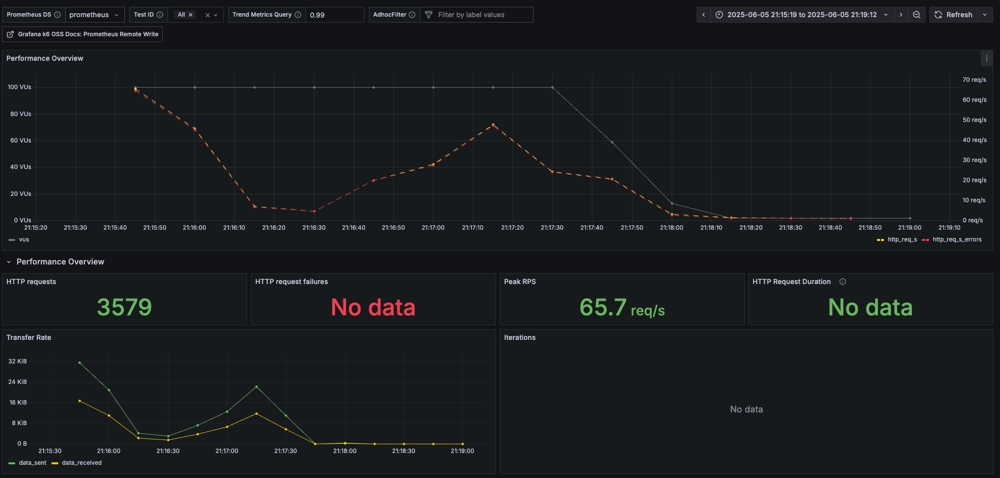

# 📊 부하 테스트 보고서

## 1. 테스트 목적

- 각 시스템의 응답 성능 및 **한계치**를 식별한다.
- 부하 발생 시 나타나는 **병목**이나 **오류**를 조기에 확인하고 성능을 개선한다.
- 서비스가 **확장성**을 확보하고 있는지 확인할 수 있다.

---

## 2. 테스트 종류 및 구성

### 🟢 Smoke Test

- **목적:** 최소한의 부하로 시스템에 치명적 오류가 없는지 확인
- **구성:** VUs 2, 주문/잔액 API 정상 동작 여부만 확인
- **테스트 대상:** `잔액 조회 API`
- **선정 이유:** 시스템의 기본 기능이 문제 없이 작동하는지 빠르게 검증 가능

- ✅ 결과: 요청 32,749건, Peak RPS 826 req/s, 실패 없음

---

### 🟡 Load Test

- **목적:** 시스템이 평균 및 피크 트래픽에서 어떻게 작동하는지 확인
- **구성:** VUs 50 기준, 평균 트래픽 조건에서 반복 호출
- **테스트 대상:** `상위 상품 조회 API`
- **선정 이유:** 전체 사용자에게 자주 호출되는 고빈도 API로, 캐시/쿼리 성능을 중점 검증

- ✅ 결과: 요청 5,851건, Peak RPS 49.0 req/s, 실패 없음

---

### 🔴 Stress Test

- **목적:** 극단적인 상황에서 시스템이 버티는 한계와 오류 상황을 확인
- **구성:** VUs 100, 총 3,579건 주문 요청 (POST)
- **테스트 대상:** `주문 생성 API`
- **선정 이유:** 복합 도메인 로직(상품/쿠폰/잔액/주문 저장)을 포함해 시스템 전체 처리 흐름을 검증 가능

- ⚠️ 결과:
    - 총 요청 3,579건 중 상당수 `i/o timeout` 및 `DB 커넥션 풀 부족` 오류 발생
    - Peak RPS 65.7 req/s
    - HTTP 실패율 증가

---

## 3. 스트레스 테스트 개선 방안

### 주요 원인
- `DataSource` 커넥션 풀 부족 (예: `request timed out after 10004ms`)
- 동시 요청 대비 커넥션 수 부족 → 요청 대기 큐가 길어지고 타임아웃 발생

### 개선 조치
1. **DB 커넥션 풀 증가**
    - HikariCP 최대 커넥션 수(`maximumPoolSize`)를 현재 애플리케이션의 피크 동시 요청 수 기준으로 조정
    - 계산식 예시: `최대 VUs × 1.5` 또는 `VUs / 평균 처리시간(s)`

2. **쿼리 최적화**
    - 주문 생성 시 조인 및 조회 쿼리 최적화
    - 불필요한 트랜잭션 길이 줄이기

---

## 4. 테스트 환경 정보

- 테스트 도구: `k6`, `Prometheus`, `Grafana`
- 데이터 수집 방식: Prometheus Remote Write → Grafana Dashboard 시각화
- 테스트 시나리오: 각 스크립트 별 동시 사용자, 반복 횟수, Sleep 간격 다르게 구성

---

## 5. 결론

- Smoke 및 Load 테스트는 안정적인 결과를 보였으며, 주요 API는 충분한 응답 성능을 확보하고 있음
- Stress 테스트는 병목 구간 및 자원 부족 문제를 노출시켰고, 이를 기반으로 튜닝 및 구조 개선이 필요함
- 각 테스트는 운영 시스템에 무리가 가지 않도록 모니터링 기반으로 안전하게 수행되었으며, 향후 주기적인 부하 테스트를 통해 점진적 개선이 필요

